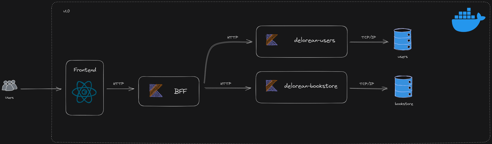

# Delorean Bookstore Inc.
> "The future's past latest bookstore in town." - Someone, sometime. (probably 1985)

The Delorean Bookstore app is exactly what it's name implies, and also a cozy place to fellow Back to the future nerds out there.

The bookstore app is fully developed in kotlin, with springboot framework and aims to have a scalable microsservice architecture, which can be accessed 
through the **docs** (<- this will be a link someday). 

## The delorean-bookstore repo
This repo contains the apps main microsservice, and is fully maintained as a personal project by @Eric-chagas (eric_chagaso@protonmail.com).
Feel free to clone it, fork it, or do whatever else suits you best. If you want to get technical, head over to the **docs** and snoop around to 
learn a bit more. 

## Features

- Delorean bookstore main microsservice. It's responsible for plenty at the moment

## Software Architecture

> Last updated: 06/06/2023



## Recommended Prerequisites

#### Linux 

|      Tool      | Version * |                         Official Docs                         |
| :------------: | :-------: | :-----------------------------------------------------------: |
|     docker     | 20.10.21  |                   https://docs.docker.com/                    |
| docker-compose |  1.29.2   | https://docs.docker.com/engine/reference/commandline/compose/ |
|      git       |  2.34.1   |                    https://git-scm.com/doc                    |

\* Recommended versions, might work with something else

## Installation

### Steps

1. Clone the repository to your local machine:

   ```shell
   git clone https://github.com/your-username/your-repo.git

2. Open the Dockerfile in the project directory and update the volume binding to match your local repository directory. Modify the following line:

    ```dockerfile
    volumes:
        - /path/to/your/local/repo:/app

3. Replace /path/to/your/local/repo with the absolute path to your local repository directory.

4. Run the following command to start the application using Docker Compose:

    ```shell
    docker-compose up

5. Once the containers are up and running, open a new terminal window and enter the application container using the following command:

    ```shell
    docker exec -it container-name /bin/bash

6. Inside the container, navigate to the application directory and build the Gradle app:

    ```shell
    cd /app
    ./gradlew build

7. After a successful build, run the Gradle app on port 8080:

    ```shell
    ./gradlew bootRun -Dserver.port=8080

The app will now be running on port 8080. You can access it by opening a web browser and navigating to http://localhost:8080 or sending HTTP requests to this same address.

## Usage

- Nothing to say yet, have fun(?) i guess

## Contribution

- I'll make the effort of thinking about this in the future

## License

- This project is licensed under the GNU General Public License v3.0. 
For more information, please refer to the [LICENSE](LICENSE) file.

## Contact

- eric_chagaso@protonmail.com.

---


This project is powered by a time-traveling delorean, remember, AI can't hurt you in 1955 ;)


Brasília, Brasil
June, 2023